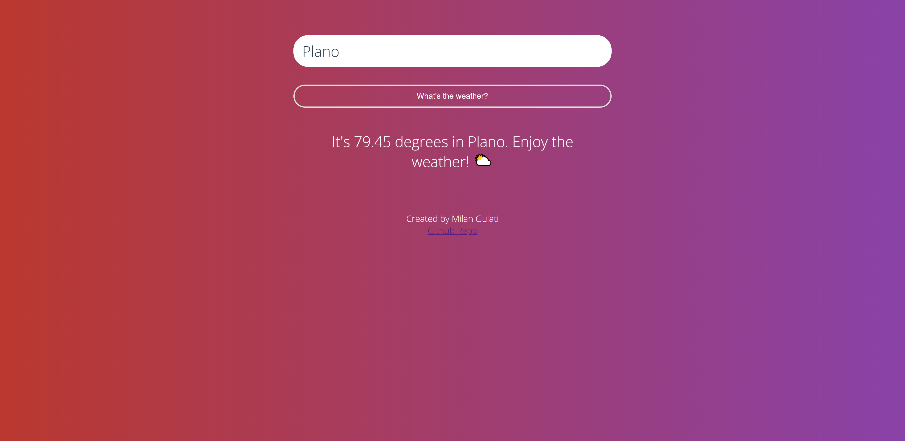
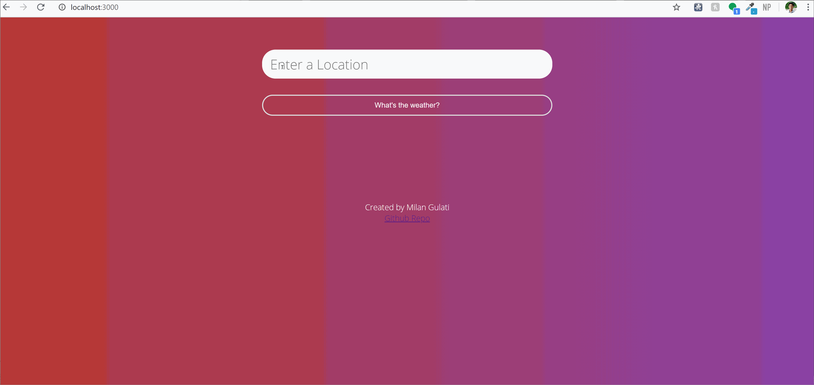

# Temperature App

### Description
This web application is built using node.js as a runtime platform, and express for its front-end capabilities. Page responses are done in javascript and styling was done with pure CSS.

### Functionality

This web application displays the current temperature of over 200,000 cities and locations by using the Current Weather Data API. The user can type in any location desired and the webpage will respond with the current temperature.

### Features
- [x] 1. User input of any location (City, State, Country)
- [x] 2. Accurate temperature reading using Open Weather Map's API
- [x] 3. Web app responds differently to each temperature.

### WIP Features
- [] 1. Reactive background to weather in selected city. Ex: Sunny for hot weather, snow for cold weather below 32F. 
- [] 2. Customization features.
 
